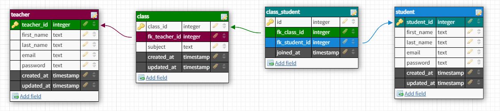

# Assessment

## Index:
1. [Overview](#Overview)
2. [API](#API)
3. [Middleware](#Middleware)
4. [Database Design](#Database-Design)

---
## Overview

- Created a REST API according to the task assigned.
- Dependencies :
  - *Express* to create the API.
  - *Bcrypt* to hash the password.
  - *Cookie-parse* to parse and set cookies for authorization.
  - *JsonWebToken* for role based authorization.
  - *pg* to query postgreSQL.
- *Postman* was used to test the API.
- There are two main router categories :
  - */teacher* to access the teacher endpoints.
  - */student* to access the student endpoints.
- Role based authorization is implemented such that student cannot access teachers resources and vice-versa.
- Operations that can be performed by the teacher:
  - Create an account.
  - Login.
  - Delete the account.
  - Create a class.
  - Delete a class.
  - Add student to the class.
  - Remove student from the class.
  - Get all the students from the class.
- Operations that can be performed by the student:
  - Create an account.
  - Login.
  - Delete the account.
  - Enroll in a class.
  - Leave the class.
  - Get all the class.
- PostgreSQL is used for the database. (Check database design)

---
## API

**POST** */teacher/signup*
- Creates a new account for the teacher.
- *Request* body has fistname, lastname, email and password in JSON.
- example,
```
{
  firstname: "Rachit",
  lastname: "Naithani",
  email: "rachitnaithani@gmail.com",
  password: "rachit123"
}
```
- *Response*
  - `201` account created.
  - `409` email already exists.
  - `400` error.


**POST** */teacher/signin*
- Logs in the user.
- *Request* body has email and password in JSON.
- example,
``` 
{
  email: "rachitnaithani@gmail.com",
  password: "rachit123"
}
```
- *Response*
  - `200` accept.
  - `401` email and password doesn't match.
  - `400` error.


**DELETE** */teacher*
- Deletes the account of the teacher who sends the request.
- *Response*
  - `200` account deleted.
  - `400` error.
  
  

**POST** */teacher/class*
- Creates the class associated with the teacher who sends the request.
- *Request* body has subject in JSON.
- example,
``` 
{
  subject: "Maths 101",
}
```
- *Response*
  - `201` class created.
  - `400` error.


**DELETE** */teacher/:classif*
- Deletes the class using id provided in query params.
- Also, verifies that the teacher is associated with that class before deleting it.
- *Response*
  - `200` class deleted.
  - `406` no such class associated with the teacher
  - `400` error.


**POST** */teacher/:classid/:studentid*
- Adds the student to the class using class-id and student-id.
- Both student-id and class-id are provided in query params.
- Also, verifies that the teacher is associated with that class before adding the student.
- *Response*
  - `200` student added.
  - `406` no such class associated with the teacher
  - `400` error.
  

**DELETE** */teacher/:classid/:studentid*
- Removes the student from the class using class-id and student-id.
- Both student-id and class-id are provided in query params.
- Also, verifies that the teacher is associated with that class before removing the student.
- *Response*
  - `200` student removed.
  - `406` no such class associated with the teacher
  - `400` error.


**GET** */teacher/:classid*
- Returns the firstname and lastname of the students enrolled in the class.
- Class-id is provided in query params.
- Also, verifies that the teacher is associated with that class.
- *Response*
  - `200` accepted.
```
[  
  {
    "first_name": "Rachit",
    "last_name" : "Naithani"
  },
  
  {
    "first_name": "Home",
    "last_name" : "Jam"
  },
]
```
  - `406` no such class associated with the teacher
  - `400` error.
---
**POST** */student/signup*
- Creates a new account for the student.
- *Request* body has fistname, lastname, email and password in JSON.
- example,
```
{
  firstname: "Rachit",
  lastname: "Naithani",
  email: "rachitnaithani@gmail.com",
  password: "rachit123"
}
```
- *Response*
  - `201` account created.
  - `409` email already exists.
  - `400` error.


**POST** */student/signin*
- Logs in the user.
- *Request* body has email and password in JSON.
- example,
``` 
{
  email: "rachitnaithani@gmail.com",
  password: "rachit123"
}
```
- *Response*
  - `200` accept.
  - `401` email and password doesn't match.
  - `400` error.


**DELETE** */teacher*
- Deletes the account of the student who sends the request.
- *Response*
  - `200` account deleted.
  - `400` error.
  


**DELETE** */teacher*
- Deletes the account of the student who sends the request.
- *Response*
  - `200` account deleted.
  - `400` error.
  

**POST** */student/:classid*
- Enrolls the student to the class who's id is provided in query params.
- *Response*
  - `201` enrollment successfull.
  - `400` error.
  

**GET** */student/classes*
- Returns the subject name, firstname and lastname of the class user is enrolled in.
- *Response*
  - `200` accepted.
```
[  
  {
    "subject_name" : "Maths 101",
    "first_name": "Rachit",
    "last_name" : "Naithani"
  },
  
  {
    "subject_name" : "Chem 101",
    "first_name": "Home",
    "last_name" : "Jam"
  },
]
```
  - `400` error.
  

**DELETE** */student/:classid*
- Removes the student from the class using class-id.
- Class-id are provided in query params.
- Also, verifies that the student is enrolled or not.
- *Response*
  - `200` class left.
  - `406` no such class found.
  - `400` error.
  
  
---
## Middleware

- Middleware is used for role based authorization.
- JsonWebToken is used for authorization purposes.
- JsonWebToken contains the userid and role ("teacher" or "student").
- This token is send to the user as a cookie after successfull login or signup.
- Every path starts with /teacher or /student.
- Middleware parses this path and extracts the term "teacher" or "student".
- Middleware then matches this with "role" in jsonwebtoken of the sender.
- If both the role matches, a `401` is sent back to the user.
- Tokens that are tampered with, are reject and `401` is sent back to the user.
- Also, request with no tokens are also responded with `401` except /login or /signup.

---
## Database Design



- Details of the teacher is inserted in 'teacher' table.
- Details of the student is inserted in 'student' table.
- Details of the class is inserted in 'class' table with 'fk_teacher_id' as the foreign key.
- 'teacher' table and 'class' table as one-to-many relationship.
- This means that, class will have one and only teacher but a teacher can have mulitple classes.
- The through table 'class_student' is used to establish many-to-many relationship between class and students.
- This means every student has multiple classes and every classes have multiple students.
- All foreign keys has `ON DELETE CASCADE` constraint.
- This means whenever a parent row is deleted, all its children row will also be deleted.
- For example, if a teacher deletes her/his account all their classes will be deleted from 'class' table and 'class_student' table.
- Refer to schema.sql for the schema of all the tables.
